<picture>
  <source media="(prefers-color-scheme: dark)" srcset="assets/banner-dark.svg" />
  
</picture>

<p align="center">
  <a href="https://suphanat91.github.io/portfolio/"></a>
  <a href="mailto:suphanatsaradee@gmail.com"></a>
  <a href="https://suphanat91.github.io/erp-ai-demo/"></a>
</p>

## `> whoami`

```ts
const suphanat = {
  role: "Software Engineer @ GISTDA (Thailand's space agency)",
  base: "Chonburi, Thailand",
  building: [
    "flight software on NASA's core Flight System (cFS)",
    "drone Remote ID: ESP32-S3 firmware + a React Native scanner app",
    "web apps with Angular and Next.js",
  ],
  infra: ["Linux servers", "Docker"],
  education: "B.Eng. Computer Engineering, first-class honours (GPA 3.84)",
  award: "3rd Place, ASEAN Geospatial Challenge 2025",
};
```

## `> stack`

<picture>
  <source media="(prefers-color-scheme: dark)" srcset="https://skillicons.dev/icons?i=c%2Ccpp%2Cjs%2Cts%2Cphp%2Creact%2Cangular%2Cnextjs%2Cvite%2Chtml%2Ccss%2Ctailwind%2Cmysql%2Cdocker%2Clinux%2Cgit%2Carduino&perline=9&theme=dark" />
  
</picture>

## `> ls ./featured`

<table>
  <tr>
    <td width="50%" valign="top">
      <h3>🛰️ <a href="https://github.com/Suphanat91/portfolio">portfolio</a></h3>
      <p>My site in English and Thai: photo gallery, full-screen viewer and an animated Remote ID radar.</p>
      <p><a href="https://suphanat91.github.io/portfolio/"><b>Live →</b></a></p>
      
      
    </td>
    <td width="50%" valign="top">
      <h3>📊 <a href="https://github.com/Suphanat91/erp-ai-demo">erp-ai-demo</a></h3>
      <p>Demo of an AI-powered ERP for software, hardware and cloud businesses, with CRM, projects and finance.</p>
      <p><a href="https://suphanat91.github.io/erp-ai-demo/"><b>Live →</b></a></p>
      
      
    </td>
  </tr>
  <tr>
    <td width="50%" valign="top">
      <h3>📡 <a href="https://github.com/Suphanat91/ESP32-S3-DroneID">ESP32-S3-DroneID</a></h3>
      <p>Open Drone ID (Remote ID) test firmware for ESP32-S3.</p>
      
      
    </td>
    <td width="50%" valign="top">
      <h3>🔐 <a href="https://github.com/Suphanat91/atecc608B-ESP32">atecc608B-ESP32</a></h3>
      <p>Using the Microchip ATECC608B secure element with ESP32-S3.</p>
      
      
    </td>
  </tr>
  <tr>
    <td width="50%" valign="top">
      <h3>🌡️ <a href="https://github.com/Suphanat91/ESP32-Netpie-PLC-Labview">ESP32-Netpie-PLC-Labview</a></h3>
      <p>ESP32 examples for NETPIE over MQTT, plus LabVIEW and PLC connection files.</p>
      
      
    </td>
    <td width="50%" valign="top">
      <h3>📝 <a href="https://github.com/Suphanat91/Research_PDF">Research_PDF</a></h3>
      <p>Web app for submitting and reviewing research articles, with PDF evaluation forms.</p>
      
      
    </td>
  </tr>
</table>

## `> git log --graph`

<picture>
  <source media="(prefers-color-scheme: dark)" srcset="https://raw.githubusercontent.com/Suphanat91/Suphanat91/output/github-snake-dark.svg" />
  
</picture>

<p align="center"><sub>🥉 3rd Place · ASEAN Geospatial Challenge 2025 &nbsp;·&nbsp; 🎓 First-class honours, Computer Engineering</sub></p>
